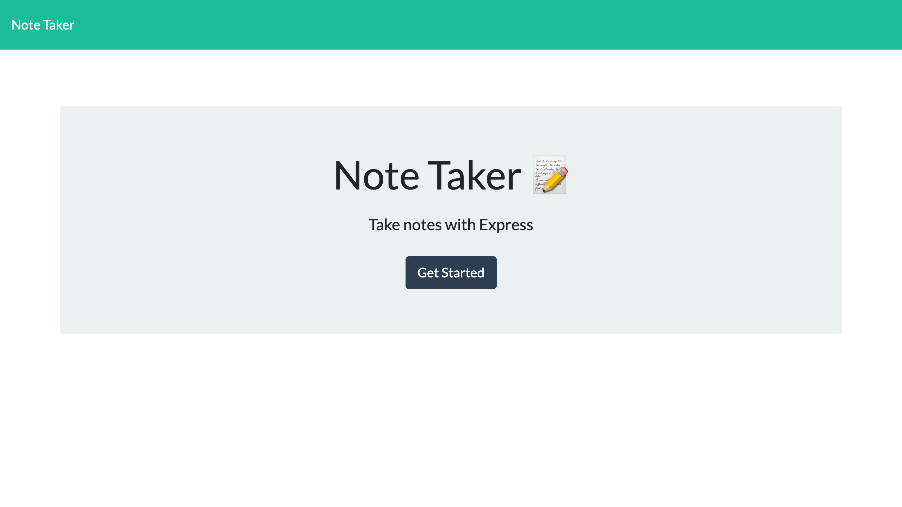
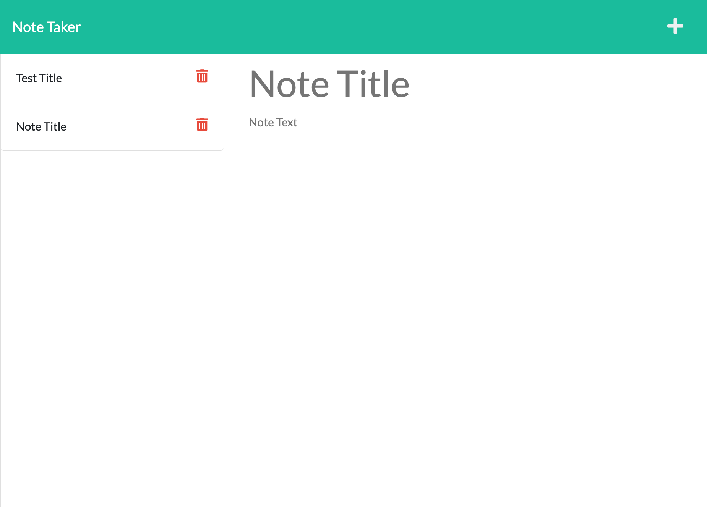

# Note-Taker

## Description

A notetaking app using Express.js. This project makes use of the REST API methods Get, Post, and Delete. Express.js and JSON is used on the backend to handle the API routing and data storage.

## Languages and Tools Used

- HTML
- CSS
- Javascript
- Express.js
- JSON
- Heroku
- UUID

## Link to live Page

https://infinite-dusk-40441.herokuapp.com/

